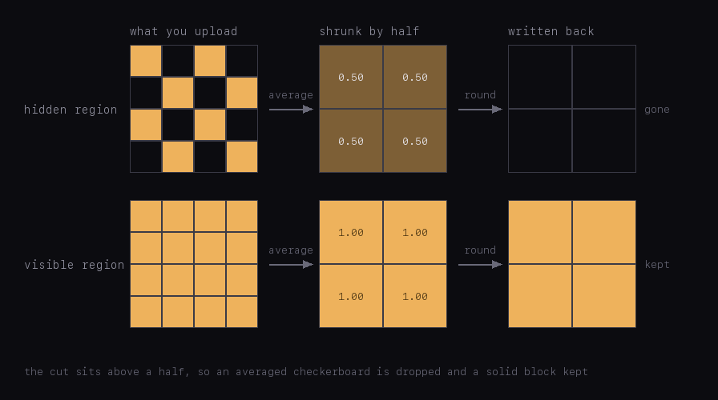

# How the "press and hold" images on X actually work

There is a format going around on X right now. In the timeline you see one picture. You open
it, or press and hold, and it turns into a different one. A glowing emblem alone on an empty
field becomes a full illustration.

I wanted to make these. Every explanation I could find described a different technique than
the one these posts use, so I took one of the images apart myself.

If you just want to make one: **[the tool is here](https://latent-x.vercel.app/)**. It runs
entirely in your browser.

## The short answer

X does not show your upload in the timeline. It shrinks the file and writes a new one, and it
writes it in the same shape it received. Upload a palette PNG in which every pixel is either
solid or fully transparent, and the preview is built that way too: there is no place in it to
store a pixel that is half visible.

Shrinking averages neighbouring pixels together. So if you delete every second pixel of a
region, in a checkerboard pattern, that region averages out to half visible — and a half
cannot be stored, so it gets rounded. It rounds down. The region disappears completely.

Your original file still has its checkerboard. Open it and the picture is there.



The rest of this is how I know, and the practical limits that come out of it.

## The clue is visible if you just zoom in

Download one of these images and magnify it. The hidden part is not a faint translucent wash.
It is a grid: one pixel of picture, one empty pixel, alternating in both directions.

Nobody would draw a grid like that to make a colour illusion. You would draw it if you
expected the image to be shrunk, because shrinking averages neighbouring pixels together, and
a grid like that is built to land on a particular average.

That is what pointed at the resizer.

## What is actually in the file

The reference I worked from is [this post](https://x.com/jm7Jimin/status/2080881842488820214).
I pulled the original and every preview size X exposes, and looked at the bytes.

The original and the timeline preview are both 8-bit palette PNGs. In both of them every pixel
is either solid or fully transparent. Nothing is half-visible anywhere.

This also settles a claim you will read elsewhere: that the timeline copy is a JPEG, flattened
onto white because JPEG cannot store transparency. It is neither. The copy X serves in the
timeline is a palette PNG and it still carries transparency. Had it been flattened onto white,
none of these posts would survive dark mode, and they plainly do.

The transparent pixels are not scattered, either. Every one of them sits on one half of a
checkerboard, and not a single one on the other half. That checkerboard covers almost the
whole picture, and inside it every second pixel has been deleted. The rest — the emblem you
see in the timeline — is left solid.

## What X does to it

X keeps a few fixed preview sizes. The two that matter here are 1200px and 2048px.

Pull the 1200px preview and the hidden region is not half transparent any more. It is gone.

That happens because of the palette. Shrinking averages the transparency of neighbouring
pixels, and across a checkerboard the average is a half. But the preview gets written the same
way the upload was: a palette PNG with one transparent entry and no in-between values. There is
nowhere to put a half, so it has to be rounded.

That last part depends on what you hand X, not on X alone. Upload a PNG with soft, graded
transparency and the preview keeps it — the older technique further down would not work at all
otherwise, since the timeline shows a preview too. Upload a palette PNG with two states and the
preview has two states as well. The trick lives in that second case.

I measured where the rounding falls. For each pixel of the preview I worked out how much of
the area it came from had been solid, then checked whether that pixel survived. The answer is
a clean step. Half rounds down to transparent. Solid stays solid. Nothing lands in between.

I do not know which shrinking method X uses, and it turns out not to matter. Shrink the
original's transparency yourself, with any of the standard methods, round it at the step above,
and you get back the exact mask X serves. Every pixel of it, apart from the ones sitting on the
border between the hidden region and the solid one, where a pixel sees a mix of the two and the
rounding decides by a hair. A one-pixel checkerboard is symmetric, so everything averages it to
a half.

That is the whole trick.


Every post of this kind I pulled apart had the same structure, so this is not one person's
export settings.

Then I wrote an encoder that follows this description and nothing else: palette PNG, one
transparent entry, a one-pixel checkerboard over the region to hide. The output behaves as
predicted — gone from the timeline in both themes, back on tap. That encoder is the tool
linked above.

## Why it works in dark mode

Because the region ends up completely transparent rather than partly, nothing gets mixed. It
simply shows whatever is behind it — white in light mode, dark grey in dark mode, the same as
the background around it either way. The background is not part of the mechanism at all.

Here is the transparency itself, magnified, with transparent pixels marked in magenta — the
original, the 2048px preview and the 1200px preview.


The middle panel is the interesting one. That preview is barely smaller than the original,
which is not enough to average the checkerboard evenly. The rounding fires almost at random
and the region breaks into speckle instead of vanishing. Two of the limits below come out of
this.

## What the other write-ups describe

The documented technique — [in Japanese](https://zenn.dev/maaaaph/articles/8a6fb4a1b0b06f) and
[in English](https://tapandhold.com/tools/how-to-make-tap-and-hold-images) — is about background
colours. X shows
images against white in the timeline and against black in the fullscreen viewer. So you build
a semi-transparent PNG where every pixel is solved for both of those at once:

```
seen on white = colour × α + white × (1 − α)
seen on black = colour × α + black × (1 − α)
```

Two equations, two unknowns, and each pixel's colour and transparency fall out.

This works, but only on those two backgrounds. Dark mode is a third one: not black, just dark
grey. On it the file shows something close to the hidden picture, right there in the timeline
where the cover was supposed to be. Nothing is left to reveal. The people who documented the
technique say so directly — the reference implementation for it is
[labelled ダークモード不可](https://github.com/Kazuhito00/DualImagePNG-for-X), dark mode not
supported.

That limit is enough to rule it out here. The posts going viral now work in dark mode.

## The checkerboard has to be exactly one pixel

Each pixel of a preview averages a block of source pixels — a 2×2 block when the image is
halved. For that average to be a half every time, the block has to hold a whole number of
checkerboard squares.

One-pixel squares always do: any 2×2 block holds two solid pixels and two transparent ones.
Four-pixel squares do not. A 2×2 block falls inside a single square, so it is either all solid
or all transparent, the rounding fires arbitrarily, and the region turns into coarse noise.

Bigger squares work only if the image is shrunk harder, and the requirement climbs fast. A
two-pixel square already needs the image shrunk threefold, and X caps uploads at 4096px, so
anything larger would need a file that does not fit. One pixel is the only size available.


## The upload size is a window, not a minimum

The timeline gets a preview of at most 1200px, and the checkerboard needs the image halved to
average cleanly. So the upload needs a long side of at least 2400px. Below that the timeline
shows speckle instead of nothing.

There is an upper limit too, and it lands on the same 4096px where X caps uploads. At that size
the picture never comes back on a phone: it stays transparent when the image is opened and
after pressing and holding, while the same file reveals correctly on desktop. The
straightforward reading is that the phone never loads the true original. It stops at the 2048px
preview, and at a 4096px upload that preview is a halving as well, so it hides the picture just
as thoroughly as the timeline does.

So there are two bounds. At least 2400px, or the timeline speckles instead of going clean.
Under 4096px, or the preview the reveal actually loads hides the picture too. The reference
post sits at 2432px, right at the lower edge.

The lower bound is measured directly and repeatedly. The upper one rests on a single hands-on
test, and which preview the phone requests is inferred from the behaviour rather than observed
on the wire.

## Making one

The requirements, all of which the tool handles:

- A palette PNG where every pixel is either solid or fully transparent. Partial transparency
  does not survive the rebuild, so writing it accomplishes nothing.
- A one-pixel checkerboard over everything you want hidden, solid pixels everywhere else.
- Long side between 2400px and 4096px.
- Under 5MB. Above that, X re-encodes the upload as a JPEG and the transparency is gone. (This limit
  and the 4096px cap come from David Buchanan's
  [tweetable-polyglot-png](https://github.com/DavidBuchanan314/tweetable-polyglot-png)
  write-up; I did not verify them myself.)
- Post the file exactly as exported. A screenshot, or a re-save through another app, drops
  either the palette or the transparency. Uploading from a desktop is the safer route.

One thing no tool mentions. The revealed picture keeps only every second pixel, so against the
dark background of the viewer it reads at about half brightness. If your reveal looks muddier
than the source, that is why. Brightening the hidden region before encoding compensates for it,
at the cost of clipping highlights.

## Reproducing this

None of this came from documentation. X publishes nothing about how it builds previews, and the
write-ups that exist describe a different technique. It was reverse engineered: zoom in, notice
the grid, work out why a grid would be there at all, then post test files and measure what
comes back.

The measurements behind every claim here are scripts in
[the repository](https://github.com/damirsch/latent-x) under `research/`. They fetch the
reference post's previews and recompute the palette structure, the checkerboard geometry, the
rounding threshold, the per-size behaviour, the square-size limits, and the comparison that
rebuilds X's own transparency mask from the original. The encoder can also be run outside the
browser, to check that its output has the same structure as the file X serves.

If you find a case where this breaks, I would like to know.
