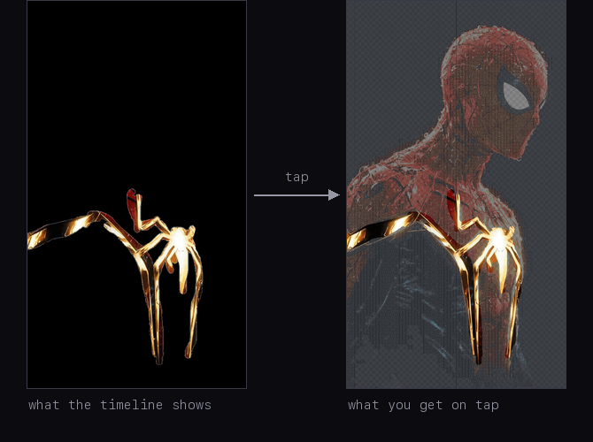

# How the "press and hold" images on X actually work

There is a format going around on X right now: an image that looks like one thing in the
timeline and turns into something else the moment you open it or press and hold. A glowing
emblem alone on an empty field becomes a full illustration.



I wanted to make these, so I went looking for an explanation, and every write-up I could
find described a different technique than the one these posts actually use. So I took one of
the images apart myself: zoomed in until I noticed something none of the articles mentioned,
formed a theory about it, and posted test files until the theory stopped being wrong.

If you just want to make one: **[the tool is here](https://latent-x.vercel.app/)**. It runs entirely in your browser.

## The explanation everyone gives, and what it costs

The technique you will find documented — [in Japanese](https://zenn.dev/maaaaph/articles/8a6fb4a1b0b06f)
and [in English](https://tapandhold.com/tools/how-to-make-tap-and-hold-images) — is about
background colours. X shows images against white in the timeline and against black in the fullscreen
viewer. So you build a semi-transparent PNG where every pixel is solved for both outcomes at
once:

```
seen on white = colour × α + white × (1 − α)
seen on black = colour × α + black × (1 − α)
```

Two equations, two unknowns. Solve them and each pixel's colour and transparency fall out.

This works, but only if the timeline is white. In dark mode it is black — the very background
the hidden picture was solved for — so the timeline shows the hidden picture instead of the
cover, and the viewer shows the same thing again. Nothing is
left to reveal. The people who documented the technique say so directly — the reference
implementation for it is [labelled ダークモード不可](https://github.com/Kazuhito00/DualImagePNG-for-X),
dark mode not supported.

That bothered me, because the posts going viral right now work fine in dark mode. Whatever
they are doing, it is not this.

## The clue is visible if you just zoom in

Download one of these images and magnify it. The hidden part is not a smooth translucent
wash, which is what the arithmetic above would produce. It is a grid: one pixel of picture,
one fully transparent pixel, alternating in both directions.

That reframes the problem. Nobody would draw a one-pixel grid to make a colour illusion. You
would draw it if you expected the image to be **shrunk**, because shrinking averages
neighbouring pixels, and a grid like that is built to land on a particular average.

So the question was never how the pixels get composited against a background. It was what
happens to them inside X's resizer.

## What is actually in the file

The reference I worked from is [this post](https://x.com/jm7Jimin/status/2080881842488820214).
I pulled the original and every preview size X exposes, and looked at the bytes.

Both the original and the timeline version are 8-bit palette PNGs. In both of them every
pixel is either fully opaque or fully transparent — nothing is half-visible anywhere. That
alone rules out the technique above, which lives entirely in the in-between values.

It also settles a claim the English write-up makes: that the timeline copy is a JPEG, flattened
onto white because JPEG cannot store transparency. It is neither. The copy X serves in the
timeline is a palette PNG, and it still carries transparency. If it had been flattened onto
white, none of these posts would survive dark mode, and they plainly do.

So the effect comes from _which_ pixels are transparent, and in the data the grid is exact:
every transparent pixel sits on one half of a checkerboard, and not a single one on the other
half. That checkerboard covers all but a small fraction of the picture, and inside it every
second pixel has been deleted. The rest — the emblem you see in the timeline — is left solid.

## What X does to it

X does not serve your upload in the timeline. It serves a smaller variant, from a handful of
fixed sizes; the two that matter here are 1200px and 2048px.

Pull the 1200px one and the hidden region is no longer half transparent. It is **entirely**
transparent. Not faint. Gone.

The reason is that palette. Building a variant means shrinking the image, and shrinking
averages the transparency of neighbouring pixels, which across a checkerboard comes out at
half. But X re-encodes the result the way it received it: a palette PNG with one transparent
entry and no in-between values. There is nowhere to put a half, so it has to round.


That depends on what you hand it, not on X alone. A PNG with soft, graded transparency keeps
that transparency through the resize — the older technique above would never work otherwise,
since the timeline shows a variant too, not the original. Hand X a palette PNG with two states
and the variant comes back with two states. The trick lives in that second case.

I measured where it rounds. For each pixel of the variant I worked out how much of the area it
came from had been opaque, then checked whether that pixel survived. The answer is a hard step
with nothing on either side of it: half coverage rounds down to fully transparent, solid
areas round up to fully opaque, and nothing lands in between.

The obvious objection is that I do not know which resizing method X uses. It turns out not to
matter. Shrink the original's transparency yourself, with any of the standard methods, round it
at the step above, and you get back the exact mask X serves — every pixel of it, apart from
those sitting on the border between the hidden region and the solid one, where a pixel sees a
mix of both and the rounding decides by a hair. A one-pixel checkerboard is symmetric, so
everything averages it to a half.

That is the whole trick. An image gets shrunk, its transparency gets rounded to on or off,
and a one-pixel checkerboard is built to sit just below where the rounding falls.


Every post of this kind I pulled apart had the same structure and the same rounding
behaviour, so this is not one person's quirk of export settings.

A description like this is worth something only if you can build from it, so I wrote an
encoder that follows it and nothing else — palette PNG, one transparent entry, a one-pixel
checkerboard over the region to hide — and posted the output. It behaves as described: gone
from the timeline in both themes, back on tap. That encoder is the tool linked at the top.

## Why this one survives dark mode

Because the region is _entirely_ transparent rather than partly, nothing gets blended. It shows
whatever is behind it — white in light mode, black in dark mode, indistinguishable from the
background either way. The background stops being part of the mechanism, which is the practical
difference from the older technique.

Here is the transparency itself, magnified, with transparent pixels marked in magenta — the
original, the 2048px variant and the 1200px variant:


The middle panel is the interesting one. That variant is barely smaller than the original,
which is not enough to average the checkerboard evenly, so the rounding fires almost at
random and the region breaks into speckle instead of disappearing. Two of the constraints
below come out of that failure.

## The checkerboard has to be exactly one pixel

Each pixel of a variant averages a block of source pixels: a 2×2 block when the image is
halved. For that average to come out at a half every time, the block has to hold a whole
number of checkerboard squares.

One-pixel squares always satisfy that — any 2×2 block holds two opaque pixels and two
transparent ones. With four-pixel squares a 2×2 block falls inside a single square, so
coverage is either none or all, the rounding fires arbitrarily, and the region turns into
coarse mosaic noise.

Bigger squares can be rescued by shrinking harder, but the requirement climbs fast: a
two-pixel square already needs the image shrunk threefold, and X caps uploads at 4096px, so
anything above two pixels would need a file that does not fit. One pixel is effectively the
only size available, which is why every one of these posts uses it.


## The upload size is a window, not a minimum

The lower bound follows from all of the above. The timeline is served a variant of at most
1200px, and the checkerboard needs the image halved to average cleanly, so the upload needs a
long side of at least 2400px. Below that the timeline shows speckle instead of nothing.

There is an upper bound as well, and it lands on the same 4096px where X caps uploads. At that
size the picture never comes back on a phone: it stays transparent when the image is opened
and after pressing and holding, while the same file reveals correctly on desktop. The
straightforward reading is that the mobile gesture does not fetch the true original — it stops
at the 2048px variant, and at a 4096px upload that variant is a halving too, so it hides the
picture just as thoroughly as the timeline does. Desktop does fetch the original, which is why
it behaves differently.

So the size has two bounds. At least 2400px, or the timeline speckles instead of going clean.
Under 4096px, or the variant the reveal actually loads hides the picture too. The reference
post sits at 2432px, right at the lower edge. The lower bound is measured directly and
repeatedly; the upper one rests on a single hands-on test, and which variant the mobile
gesture requests is inferred from the behaviour rather than observed on the wire.

## Making one

The requirements, all of which the tool handles:

- A palette PNG with one transparent entry and no partial transparency. Partial transparency
  is destroyed by the re-encode, so writing it accomplishes nothing.
- A one-pixel checkerboard over everything you want hidden, solid pixels everywhere else.
- Long side between 2400px and 4096px.
- Under 5MB, above which X re-encodes the upload as a JPEG and the transparency is gone. (This limit
  and the 4096px cap come from David Buchanan's
  [tweetable-polyglot-png](https://github.com/DavidBuchanan314/tweetable-polyglot-png)
  write-up; I did not verify them independently.)
- Post the file exactly as exported. Any screenshot or re-save through another app drops
  either the palette or the transparency. Desktop upload is the safer route.

One thing no tool mentions: the revealed region keeps only every second pixel, so against the
viewer's dark background it reads at roughly half brightness. If your reveal looks muddier
than the source, that is why. Brightening the hidden region before encoding compensates for
it, at the cost of clipping highlights.

## Reproducing this

None of this came from documentation. X publishes nothing about how it builds previews, and
the write-ups that exist describe a different technique. It was reverse engineered: zoom in,
notice the grid, work out why a grid would be there at all, then post test files and measure
what comes back until the theory holds or breaks.

The measurements behind every claim here are scripts in
[the repository](https://github.com/damirsch/latent-x) under `research/`. They fetch the
reference post's variants and recompute the palette structure, the checkerboard geometry, the
rounding threshold, the per-variant behaviour, the square-size limits, and the comparison that
rebuilds X's own transparency mask from the original. The encoder can also be run outside the
browser to confirm its output has the same structure as the file X serves.

If you find a case where this breaks, I would like to know.
