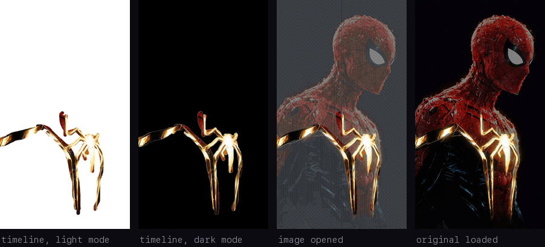
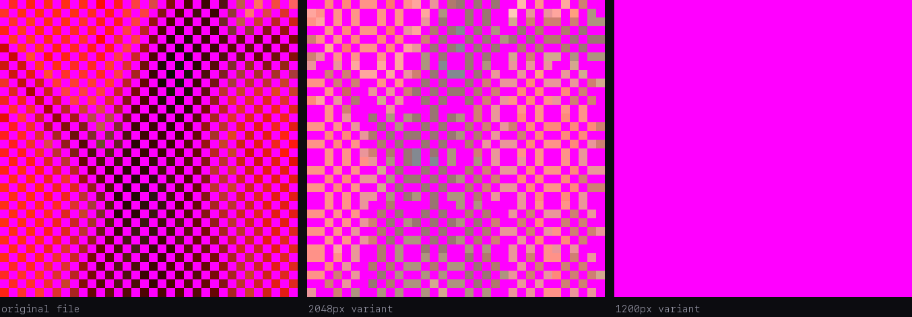
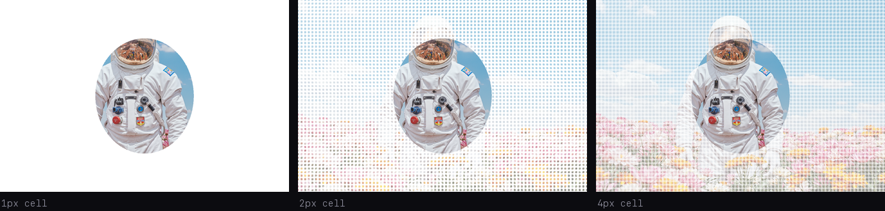

# How the "press and hold" images on X actually work

There is a format going around on X right now: an image that looks like one thing in the
timeline and turns into something else the moment you open it or press and hold. A glowing
emblem alone on a white field becomes a full illustration. Floating clothes acquire the
person wearing them.

I wanted to make these, so I went looking for an explanation, and every write-up I could
find described a different technique than the one these posts actually use. So I took one of
the images apart myself: zoomed in until I noticed something none of the articles mentioned,
formed a theory about it, and posted test files until the theory stopped being wrong.

If you just want to make one: **[the tool is here](https://latent-x.vercel.app/)**. It runs
entirely in your browser and nothing gets uploaded.

## The explanation everyone gives, and what it costs

The technique you will find documented, in English and in Japanese, is about background
colours. X shows images against white in the timeline and against black in the fullscreen
viewer. So you build a semi-transparent PNG where every pixel is solved for both outcomes at
once. Given the appearance you want on white and the appearance you want on black:

```
white_view = colour × α + 255 × (1 − α)
black_view = colour × α +   0 × (1 − α)
```

Two equations, two unknowns. Solve them and each pixel's alpha and colour fall out.

This is real and it works. But look at what it assumes. The file is solved for two specific
backgrounds, so if either background changes, the arithmetic no longer holds. Composite that
same file over an arbitrary background and you get `black_view + bg × (1 − α)`. On black you
get the hidden picture, on white you get the cover picture, and on the dark grey of dark mode
you get something very close to the hidden picture — showing in the timeline, where the cover
was supposed to be. There is nothing left to reveal. The people who documented the technique
say so directly: light mode only.

There is a second cost. Alpha cannot exceed 1, which forces the cover image to be at least
as bright as the hidden one at every single pixel. That is why every example of this
technique is a black line drawing paired with a white one.

Both of those bothered me, because the posts going viral right now work fine in dark mode,
and they are full-colour photographs and renders. Whatever they are doing, it is not this.

## The clue is visible if you just zoom in

Download one of these images and magnify it. The hidden part is not a smooth translucent
wash, which is what the arithmetic above would produce. It is a grid: one pixel of picture,
one fully transparent pixel, alternating in both directions, all the way across.

That reframes the problem. Nobody would draw a one-pixel grid to make a colour illusion. You
would draw it if you expected the image to be **shrunk**, because shrinking averages
neighbouring pixels, and a grid like that is built to land on a particular average.

So the question was not how the pixels get composited against a background. It was what
happens to them on the way through X's resizer.

## What is actually in the file

The reference I worked from is [this post](https://x.com/jm7Jimin/status/2080881842488820214).
I pulled the original and every preview size X exposes, and looked at the bytes.

Both the original and the timeline version are 8-bit palette PNGs. Each has a single fully
transparent entry in its palette, and across both files the alpha of every pixel is either 0
or 255. Nothing is half-visible anywhere.

That alone rules out the background-arithmetic technique, which exists entirely in the
intermediate values.

So the effect has to come from *which* pixels are transparent — and here the grid shows up in
the data. Sort the transparent pixels by whether `x + y` is even or odd, and the split is
absolute: **not one transparent pixel on one parity, 93% of them on the other.** Every
transparent pixel sits on one half of a checkerboard and none sits on the other half. That
checkerboard covers 93% of the picture, with exactly every second pixel deleted inside it.
The small remainder — the emblem you see in the timeline — is left completely solid.

## What X does to it

X does not serve your upload in the timeline. It serves a smaller variant, and it publishes
several: 150px, 680px, 1200px, 2048px, and the original.

Pull the 1200px one and the hidden region has gone from 50% transparent to **100%
transparent**. Not faint. Gone. The checkerboard covered 93% of the original; 93% of the
preview is empty.

The reason is the thing I noticed in the palette. Building a variant means shrinking the
image, and shrinking averages the alpha of neighbouring pixels, which in a checkerboard gives
0.5. But X then re-encodes the result as a palette PNG with a single transparent entry,
exactly like the input. There is nowhere to put a 0.5. It has to round.

I measured where it rounds, by working out for every preview pixel what fraction of its
source area had been opaque and comparing that against whether it survived. The answer is a
hard step with nothing in between: at around half coverage it rounds to fully transparent, at
around 60% it rounds to fully opaque, and no value lands anywhere else. A checkerboard
averages to exactly 0.5, which falls on the transparent side of that step. Solid areas
average to 1.0 and clear it comfortably.

That is the whole trick. An image gets shrunk, its transparency gets rounded to on-or-off,
and a one-pixel checkerboard is built to sit just below where the rounding falls.



The same structure and the same rounding behaviour turned up on every post of this kind I
pulled apart, so this is not one person's quirk of export settings.

## Why this one survives dark mode

Because the hidden region does not end up partially transparent. It ends up *fully*
transparent, which means it is not blended with anything — it simply shows whatever is behind
it. White in light mode, dark grey in dark mode, and in both cases indistinguishable from the
surrounding background.

The background stops being part of the mechanism. That is the practical difference between
this and the older technique, and it is why these posts work for everyone.

Here is the alpha channel itself, magnified, with transparent pixels marked in magenta — the
original, the 2048px variant, and the 1200px variant:



The middle panel is worth a moment. That variant is only a 1.19× downscale, which is not
enough to average the checkerboard evenly, so instead of a clean result the rounding fires
almost at random and the region breaks into speckle. This turns out to matter a lot.

## The checkerboard has to be exactly one pixel

Each pixel of a variant averages a block of source pixels — a 2×2 block at a 2× downscale, and
so on. For that average to reliably land on 0.5, the block has to contain a whole number of
checkerboard periods.

With one-pixel cells the period is two pixels, so a 2×2 block always contains two opaque
pixels and two transparent ones. With four-pixel cells the period is eight, and a 2×2 block
falls entirely inside a single cell, so coverage is either 0 or 1, the rounding fires
arbitrarily, and the region becomes coarse mosaic noise instead of disappearing.

Bigger cells can be rescued by shrinking harder, but the numbers run away fast: a 2px cell
needs a 3× downscale, a 3px cell needs nearly 5×. Since X caps uploads at 4096px, anything
from three pixels up would require an image that does not fit. One pixel is effectively the
only cell size available, which is why every one of these posts uses it.



## The upload size is a window, not a minimum

The lower bound follows from everything above. The timeline is served a variant of at most
1200px, and the checkerboard needs at least a 2× downscale to average cleanly, so the upload
needs a long side of at least 2400px. Below that, the timeline shows speckle instead of
nothing. The reference post is 2432px, sitting just inside that edge.

There is an upper bound too, and I only found it by getting it wrong.

Reading the variant list, an idea suggests itself: upload at 4096px so the 2048px variant
becomes a 2× downscale as well. Then the picture stays hidden even when someone opens it, and
only appears if they explicitly load the original — a purer version of the trick. I built
that as an option in the tool.

It does not work. Posted at 4096px, the hidden region stayed transparent on a phone both when
the image was opened and after pressing and holding. The same file revealed correctly on
desktop.

The straightforward reading is that the mobile press-and-hold never fetches the true
original — it stops at the 2048px variant. At a 4096px upload that variant hides the picture
just as thoroughly as the timeline does, so on a phone there is nothing left to reveal at any
point. Desktop does fetch the original, which is why it behaved differently.

So the requirement is two-sided:

| Bound | Reason |
|---|---|
| At least 2400px | so the timeline variant hides the checkerboard instead of speckling |
| Under 4096px | so the variant the reveal actually loads does *not* hide it |

To be clear about the evidence: the lower bound is measured directly and repeatedly. The
upper bound rests on one hands-on test, and the claim about which variant the mobile gesture
requests is inferred from the behaviour rather than observed on the wire.

## Making one

The requirements, all of which the tool handles:

- A palette PNG with one fully transparent entry and no partial alpha. Partial alpha is
  destroyed by the re-encode, so writing it accomplishes nothing.
- A one-pixel checkerboard over everything you want hidden, solid pixels everywhere else.
- Long side between 2400px and 4096px.
- Under 5MB, above which X converts the upload to a format with no transparency. (This limit
  and the 4096px cap come from David Buchanan's
  [tweetable-polyglot-png](https://github.com/DavidBuchanan314/tweetable-polyglot-png)
  write-up; I did not verify them independently.)
- Post the file exactly as exported. Any screenshot or re-save through another app drops
  either the palette or the alpha. Desktop upload is the safer route.

One thing worth knowing that no tool mentions: the revealed region keeps only every second
pixel, so against the viewer's dark background it reads at roughly half brightness. If your
reveal looks muddier than the source, that is why. Brightening the hidden region before
encoding compensates for it, at the cost of clipping highlights.

## Reproducing this

None of this came from documentation. X publishes nothing about how it builds preview
variants, and the write-ups that exist describe a different technique. It was reverse
engineered: zoom in, notice the grid, work out why a grid would be there at all, then post
test files and measure what comes back until the theory either holds or breaks. The 4096px
idea above is one that broke, and it is written up rather than quietly dropped, because that
failure is what pinned down the upper bound.

Every number here comes from scripts in
[the repository](https://github.com/damirsch/latent-x) under `research/`. They fetch the
reference post's variants and recompute the palette structure, the checkerboard geometry, the
rounding threshold, the per-variant behaviour and the cell-size limits. The encoder can also
be run outside the browser to confirm its output has the same structure as the file X serves.

If you find a case where this breaks, I would like to know.
